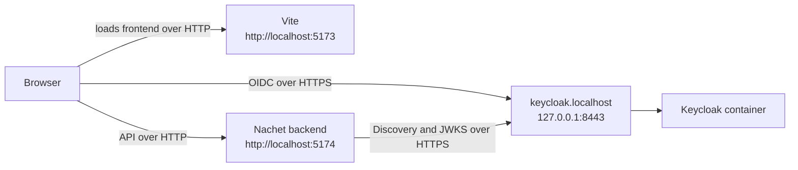
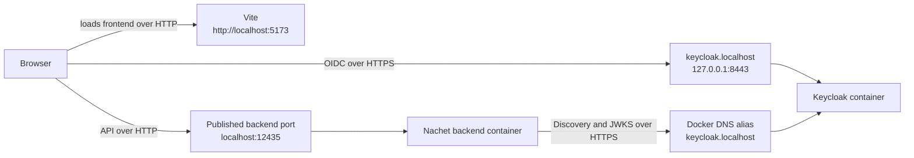
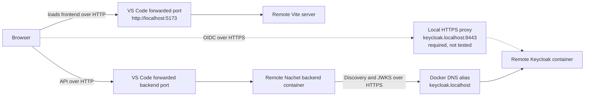
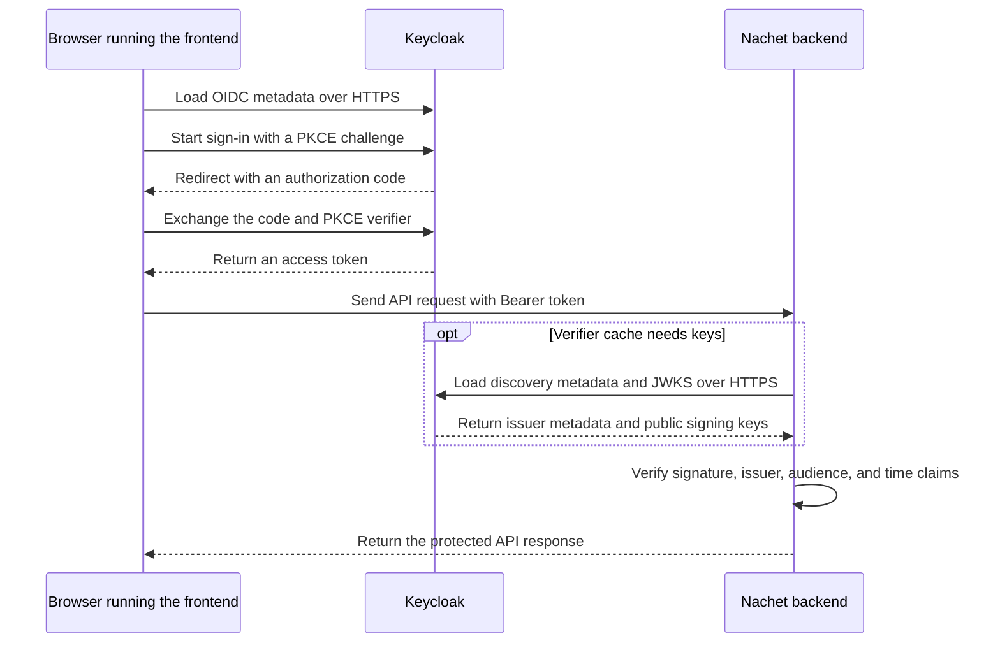

# Developer Notes

This file contains notes for developers working on the Nachet project. It includes information about the development environment, tools, and processes used in the project.
Please refer to this document for guidance on setting up your development environment and contributing to the project.
Feel free to update this document as needed to reflect changes in the development process or environment.

## Development Environment

- The project uses Docker and Docker Compose for local development.  
- The backend is built using FastAPI and the frontend uses React with Vite.
- Environment variables are managed using `.env` files located in the respective `backend` and `frontend` directories.
- Each layer can be run independently using Docker Compose.

## Setup Instructions

### Clone the repository

### Navigate to the project directory

### Local database, blob store, and pgadmin setup

```bash
nachet$ cd db

# enter your own values in the .env.config.local file
nachet/db$ cp .env.config.template .env.config.local
nachet/db$ nano .env.config.local
nachet/db$ cd ..

# create required folders
nachet$ mkdir -p db/postgres-data
nachet$ mkdir -p db/pgadmin-data
nachet$ mkdir -p blob/azurite
# optional ozone, only if you need s3 api call implemented in ozone but missing from garage
nachet$ mkdir -p blob/ozone

# create database and pgadmin containers
nachet$ docker compose -f docker-compose.yaml up -d nachet-db nachet-pgadmin 

# azurite blob storage
# you can use azure storage explorer to view the blobs https://azure.microsoft.com/en-us/products/storage/storage-explorer#Download-4
nachet$ docker compose -f docker-compose.yaml up -d nachet-blob --force-recreate

# ozone s3 compatible storage (optional)
# nachet$ docker compose -f docker-compose.yaml up -d datanode om scm recon s3g httpfs

# garage s3 compatible storage (preferred, single container)
nachet$ docker compose -f docker-compose.yaml up -d nachet-op-blob nachet-op-blob-webui --force-recreate

# check garage status
nachet$ docker exec -ti nachet-op-blob /garage status
|  ==== HEALTHY NODES ====
|  ID                Hostname      Address          Tags  Zone  Capacity          DataAvail  Version
|  63a9650ddf005cc6  c8cdccadde8e  127.0.0.1:12441              NO ROLE ASSIGNED             v2.1.0

# setup zone and capacity , replace 63a9 with your node ID
nachet$ docker exec -ti nachet-op-blob /garage layout assign -z dc1 -c 1G 63a9
|  Role changes are staged but not yet committed.
|  Use `garage layout show` to view staged role changes,
|  and `garage layout apply` to enact staged changes.

nachet$ docker exec -ti nachet-op-blob /garage layout apply --version 1 
|  ==== COMPUTATION OF A NEW PARTITION ASSIGNATION ====
|
|  Partitions are replicated 1 times on at least 1 distinct zones.
|
|  Optimal partition size:                     3.9 MB
|  Usable capacity / total cluster capacity:   1000.0 MB / 1000.0 MB (100.0 %)
|  Effective capacity (replication factor 1):  1000.0 MB
|
|  dc1                 Tags  Partitions        Capacity   Usable capacity
|    63a9650ddf005cc6  []    256 (256 new)     1000.0 MB  1000.0 MB (100.0%)
|    TOTAL                   256 (256 unique)  1000.0 MB  1000.0 MB (100.0%)
|
|
|  New cluster layout with updated role assignment has been applied in cluster.
|  Data will now be moved around between nodes accordingly.

# create access keys . put these in your env files
nachet$ docker exec -ti nachet-op-blob /garage key create nachet-local-dev-key
| ==== ACCESS KEY INFORMATION ====
| Key ID:              <your access key id>
| Key name:            nachet-local-dev-key
| Secret key:          <your secret access key>
| Created:             2025-10-19 03:58:46.375 +00:00
| Validity:            valid
| Expiration:          never
|
| Can create buckets:  false
|
| ==== BUCKETS FOR THIS KEY ====
| Permissions  ID  Global aliases  Local aliases

# create a bucket / container . put this in your env files
nachet$ docker exec -ti nachet-op-blob /garage bucket create nachet-local-dev-bucket
| ==== BUCKET INFORMATION ====
| Bucket:          7a89fed6e3b655390dc7a9e2dda7d6903a903226a0755844274b078c4bede739
| Created:         2025-10-19 04:19:45.339 +00:00
|
| Size:            0 B (0 B)
| Objects:         0
|
| Website access:  false
|
| Global alias:    nachet-local-dev-bucket
|
| ==== KEYS FOR THIS BUCKET ====
| Permissions  Access key    Local aliases

# assign permissions to the key for this bucket
nachet$ docker exec -ti nachet-op-blob /garage bucket allow --read --write --owner nachet-local-dev-bucket --key nachet-local-dev-key

| ==== BUCKET INFORMATION ====
| Bucket:          7a89fed6e3b655390dc7a9e2dda7d6903a903226a0755844274b078c4bede739
| Created:         2025-10-19 04:19:45.339 +00:00
| 
| Size:            0 B (0 B)
| Objects:         0
| 
| Website access:  false
| 
| Global alias:    nachet-local-dev-bucket
| 
| ==== KEYS FOR THIS BUCKET ====
| Permissions  Access key                                        Local aliases
| RWO          <your access key id>  nachet-local-dev-key  

# allow the key to create buckets
nachet$ docker exec -ti nachet-op-blob /garage key allow --create-bucket nachet-local-dev-key
| ==== ACCESS KEY INFORMATION ====
| Key ID:              <your access key id>
| Key name:            nachet-local-dev-key
| Secret key:          (redacted)
| Created:             2025-10-19 03:58:46.375 +00:00
| Validity:            valid
| Expiration:          never
|
| Can create buckets:  true
|
| ==== BUCKETS FOR THIS KEY ====
| Permissions  ID                Global aliases           Local aliases
| RWO          7a89fed6e3b65539  nachet-local-dev-bucket 
```  

- access pgadmin at <http://localhost:12433>  
- login with the email and password you set in the .env.config.local file  
- create a new server with the database connection details from the .env.config.local file  
- browse your database and schema using pgadmin

### observability setup grafana alloy loki

```bash
# enter your own values in the .env.local file
nachet$ cd observability
nachet/observability$ cp .env.template .env.local
nachet/observability$ nano .env.local
nachet$ cd ..
nachet$ docker compose -f docker-compose.yaml up -d grafana loki alloy
```

### Backend setup

```bash
nachet$ cd backend

# enter your own values in the .env.local file
nachet/backend$ cp .env.template .env.local
nachet/backend$ nano .env.local

# enter your own values in the .env.container.local file
nachet/backend$ cp .env.template .env.container.local
nachet/backend$ nano .env.container.local

# enter your own values in the .env.test.local file
nachet/backend$ cp .env.test.template .env.test.local
nachet/backend$ nano .env.test.local

# initialize venv
nachet/backend$ uv sync
nachet/backend$ source .venv/bin/activate

# initialize the database (creates tables, runs migrations, creates initial user)
nachet/backend$ cd app/db
nachet/backend/app/db$ export $(grep -v '^#' ../../.env.local | xargs)
nachet/backend/app/db$ uv run db_setup_local.py
nachet/backend/app/db$ export $(grep -v '^#' ../../.env.test.local | xargs)
nachet/backend/app/db$ uv run db_setup_test.py
nachet/backend/app/db$ export $(grep -v '^#' ../../.env.test.local | xargs) && uv run alembic upgrade head
nachet/backend/app/db$ export $(grep -v '^#' ../../.env.local | xargs) && uv run alembic upgrade head

# run all db tests with coverage
nachet/backend/app/db$ uv run pytest tests/ -v --tb=short --cov=. --cov-report=xml --cov-report=term-missing

# run integration tests or unit tests only
nachet/backend/app/db$ uv run pytest tests/ -v --tb=short --cov=. --cov-report=xml --cov-report=term-missing -m "integration"
nachet/backend/app/db$ uv run pytest tests/ -v --tb=short --cov=. --cov-report=xml --cov-report=term-missing -m "not integration"

# run tests
nachet/backend$ uv run pytest tests/ -v --tb=short
nachet/backend$ uv run pytest tests/ -v --tb=short -m "not integration" && uv run pytest tests/ -v --tb=short -m "integration"
nachet/backend$ deactivate

# lint
nachet/backend$  uv run ruff check --fix

# push frontend build to blob storage
nachet/backend$ uv run app/scripts/push_frontend_to_blob.py

nachet$ docker compose -f docker-compose.yaml.local build nachet-backend --no-cache && docker compose -f docker-compose.yaml.local up -d nachet-backend --force-recreate
```

#### Backend authentication

The backend supports the existing Microsoft Entra validator and a
provider-neutral OIDC validator. Entra remains the default. There is no setting
that disables authentication.

Use these values for the Entra path:

```bash
AUTH_PROVIDER="azure"
AZURE_CLIENT_ID="<api-client-id>"
AZURE_TENANT_ID="<tenant-id>"
```

Use these values for the OIDC path:

```bash
AUTH_PROVIDER="oidc"
OIDC_ISSUER="https://keycloak.localhost:8443/realms/nachet"
OIDC_AUDIENCE="nachet-api"
OIDC_USER_ID_CLAIM="sub"
OIDC_USERNAME_CLAIM="preferred_username"
OIDC_EMAIL_CLAIM="email"
OIDC_CA_BUNDLE="../keycloak/local-certs/ca/rootCA.pem"
```

OIDC discovery and JWKS always use HTTPS. `OIDC_CA_BUNDLE` adds a private CA to
the normal HTTPX trust store when a provider does not use a public certificate.

The claim selected by `OIDC_USER_ID_CLAIM` must currently contain a UUID. This
keeps the existing route and database contract intact. Supporting non-UUID
subjects or linking multiple providers to one user is tracked separately.

Use a separate local database for Keycloak. Nachet does not yet link Keycloak
accounts to existing Entra accounts.

The frontend and backend use different provider names because they select
different implementations:

| Layer | Microsoft path | OIDC path |
| --- | --- | --- |
| Frontend `VITE_AUTH_PROVIDER` | `msal` | `oidc` |
| Backend `AUTH_PROVIDER` | `azure` | `oidc` |

Run the focused backend auth tests with:

```bash
uv run pytest tests/test_oidc_token_verifier.py tests/test_oidc_discovery.py tests/test_oidc_backend_auth.py -q
```

See [backend token validation](backend/docs/nachet-jwt-validation.md) for the
request flow, validation rules, and current identity limitation.

#### Local Keycloak

Use this setup to sign in locally without a Microsoft Entra account. Complete
the database, storage, backend, and frontend setup first.

Keycloak runs in Docker and serves its OIDC endpoints over HTTPS. The setup
script creates a certificate for your machine; certificates and private keys
are not stored in the repository.

##### Local network layouts

Keycloak stays in Docker in each layout below. Direct, container, and remote
describe where the Nachet frontend and backend run.

| Setup | Frontend | Browser to Keycloak | Backend to Keycloak | Status |
| --- | --- | --- | --- | --- |
| Direct | Vite on `http://localhost:5173` | Published HTTPS port | Published HTTPS port | Tested on macOS |
| Container | Vite on `http://localhost:5173` | Published HTTPS port | Docker network alias | Tested on macOS |
| Remote | Vite through VS Code port forwarding | Local HTTPS proxy | Docker network alias on the remote machine | Not tested |

The direct and container backends can also serve the built frontend. In that
case, use the backend URL as the OIDC redirect URL: `http://localhost:5174` for
the host backend or `http://localhost:12435` for the container backend.

Every path uses the same issuer:
`https://keycloak.localhost:8443/realms/nachet`.

###### Direct



###### Container



###### Remote



The hosts-file entry is added only to the developer machine. Containers resolve
`keycloak.localhost` through Docker DNS. The browser trusts the developer's
local CA, and the backend loads its public certificate through `OIDC_CA_BUNDLE`.

The frontend itself uses HTTP for local development. The HTTPS connections in
these diagrams are the OIDC requests to Keycloak.

Remote development is not supported by this guide yet. It needs a local HTTPS
proxy so the browser can reach the remote Keycloak container at
`https://keycloak.localhost:8443`. We still need to choose and test that proxy.

After the hostname is resolved, sign-in and token validation work like this:



The backend checks the token locally with Keycloak's public signing keys. It
does not send each token back to Keycloak.

If Keycloak rotates its signing key, the backend refreshes the JWKS when it
receives a token with a new key ID. A normal Keycloak restart does not require
a backend restart.

##### 1. Install `mkcert`

| Operating system | Installation |
| --- | --- |
| macOS | `brew install mkcert` |
| Linux or WSL | Install `libnss3-tools`, then install `mkcert` from your package manager or its official release |

Firefox users on macOS may also need `brew install nss`.

##### 2. Create the local certificate

Run the setup script from the repository root:

```bash
./keycloak/setup_local_tls.sh
```

The script asks `mkcert` to trust its local certificate authority, creates a
certificate for `keycloak.localhost`, and places the public CA certificate where
the backend can read it. The CA private key stays in the local `mkcert` store.
Git ignores everything generated under `keycloak/local-certs/`.

The Keycloak private key remains at mode `0600`. When Compose starts Keycloak,
it uses the developer's UID so the container can read the bind-mounted key. It
keeps the image's group `0` so Keycloak can still write to its own directories.

`keycloak.localhost` must resolve to the loopback interface on the developer
machine. Add this entry if it does not already resolve:

```text
127.0.0.1 keycloak.localhost
```

The hosts file is `/etc/hosts` on macOS, Linux, and WSL.

##### 3. Select OIDC in the local environment files

If you do not already have local environment files, create them from the
templates:

```bash
cp backend/.env.template backend/.env.local
cp frontend/.env.template frontend/.env.config.local
```

Set the backend provider in `backend/.env.local`:

```bash
AUTH_PROVIDER="oidc"
OIDC_ISSUER="https://keycloak.localhost:8443/realms/nachet"
OIDC_AUDIENCE="nachet-api"
OIDC_CA_BUNDLE="../keycloak/local-certs/ca/rootCA.pem"
```

Set the frontend provider in `frontend/.env.config.local`:

```bash
VITE_AUTH_PROVIDER="oidc"
VITE_OIDC_AUTHORITY="https://keycloak.localhost:8443/realms/nachet"
VITE_OIDC_CLIENT_ID="nachet-frontend"
VITE_OIDC_SCOPE="openid profile email"
VITE_OIDC_API_SCOPE_CLAIM="nachet-api"
```

Keep the database, storage, and other local values from the normal setup. If
you run the backend in Docker, put the same issuer and audience in
`backend/.env.container.local`, but use the path mounted inside the container:

```bash
AUTH_PROVIDER="oidc"
OIDC_ISSUER="https://keycloak.localhost:8443/realms/nachet"
OIDC_AUDIENCE="nachet-api"
OIDC_CA_BUNDLE="/opt/nachet/local-ca/rootCA.pem"
```

The value stays in the backend environment file so another OIDC provider can
use a different CA bundle or the normal public trust store.

##### 4. Start Keycloak

```bash
KEYCLOAK_UID="$(id -u)" docker compose --profile oidc up -d --wait nachet-keycloak
./keycloak/verify_local_setup.sh
```

Open the discovery document to confirm that the browser trusts the certificate:

```text
https://keycloak.localhost:8443/realms/nachet/.well-known/openid-configuration
```

The page should open without a certificate warning, and its `issuer` value
should match the URL above exactly.

The imported realm allows the local Vite and backend URLs as login redirects
and browser origins. The verification script checks each URL and confirms that
Keycloak rejects an unlisted origin. It does not complete a browser sign-in or
call Nachet's API; those checks are in step 6.

The Keycloak configuration choices and links to the official documentation are
in [keycloak/README.md](keycloak/README.md).

##### 5. Start the backend

For a backend running directly on your machine:

```bash
cd backend
export $(grep -v '^#' .env.local | xargs)
uv run hypercorn -b :5174 app/main:app
```

For a backend running in Docker, create
`backend/.env.container.local` from the backend template, select OIDC in that
file, then run:

```bash
docker compose --profile oidc up -d --build nachet-backend
```

The container receives only the public local CA. It does not receive the
Keycloak server key or the local CA private key.

When the backend runs in Docker, set these frontend values to the published
backend port:

```bash
VITE_BACKEND_URL="http://localhost:12435"
VITE_LOG_API_URL="http://localhost:12435/logs"
```

##### 6. Start the frontend and sign in

Use Vite for normal frontend development. If your change affects authentication
or frontend startup, also test the built frontend through the backend.

###### Run Vite on your machine

Vite runs on your machine whether the backend runs directly or in Docker. Use
`http://localhost:5174` for a backend running on your machine, or
`http://localhost:12435` for a backend running in Docker. Set
`VITE_BACKEND_URL` to that URL and `VITE_LOG_API_URL` to its `/logs` endpoint
before starting Vite.

The backend environment template already allows requests from
`http://localhost:5173` through CORS.

```bash
cd frontend
export $(grep -v '^#' .env.config.local | xargs)
npm run dev -- --port 5173
```

Open <http://localhost:5173>.

###### Run through the backend

Set these values in `frontend/.env.config.local` before building:

```bash
VITE_BACKEND_URL="http://localhost:5174"
VITE_LOG_API_URL="http://localhost:5174/logs"
VITE_OIDC_REDIRECT_URI="http://localhost:5174"
VITE_OIDC_POST_LOGOUT_REDIRECT_URI="http://localhost:5174"
```

Use `http://localhost:12435` instead when the backend runs in Docker. Then build
the frontend and upload it to the local frontend blob container:

```bash
cd frontend
npm run build
cd ../backend
uv run app/scripts/push_frontend_to_blob.py --clean
```

Open the backend URL for the setup you are testing:

- <http://localhost:5174> when the backend runs on your machine;
- <http://localhost:12435> when the backend runs in Docker.

###### Check sign-in

Sign in with either account:

| Username | Password | Purpose |
| --- | --- | --- |
| `nachet-admin` | `nachet-local` | Matches the seeded local Nachet user and can exercise protected workflows. |
| `nachet-user` | `nachet-local` | Has a second UUID and can exercise the registration path. |

After sign-in, confirm that Nachet displays the user's OID and loads protected
data such as directories, then sign out. For authentication changes, repeat
this check with Vite and with the frontend served by the backend. Test both a
host backend and a container backend when the change touches networking or
container configuration.

A `401` usually means the token was rejected. A `503` usually means the backend
could not reach or trust Keycloak.

##### 7. Stop Keycloak

```bash
docker compose --profile oidc stop nachet-keycloak
```

This realm uses fixed test passwords and Keycloak's file-based development
database. Do not reuse it in a shared or deployed environment.

### Frontend setup

```bash
nachet$ cd frontend

# enter your own values in the .env.config.local file
nachet/frontend$ cp .env.template .env.config.local
nachet/frontend$ nano .env.config.local
nachet/frontend$ npm run update
nachet/frontend$ npm run test

# run dev with env vars from .env.config.local
# nachet/frontend$ source .env.config.local # requires export keyword in the file
nachet/frontend$ export $(grep -v '^#' .env.config.local | xargs)
nachet/frontend$ npm run dev -- --port 5173

# unset env vars
nachet/frontend$ unset $(grep -v '^#' .env.config.local | grep -v '^$' | cut -d= -f1)
```

### Update the compose file as needed

```bash
nachet$ nano docker-compose.yaml
```

### Start the rest of the services

```bash
nachet$ docker compose -f docker-compose.yaml up -d
nachet$ $ docker ps -a --format "table {{.Image}}\t{{.Names}}\t{{.RunningFor}}\t{{.Status}}\t{{.Ports}}"
IMAGE                                                                       NAMES                      CREATED             STATUS                      PORTS
ghcr.io/ai-cfia/nachet-backend:29-azureml-swin-classifier                   nachet-15-spp-classifier   2 minutes ago       Up 2 minutes                0.0.0.0:12390->5001/tcp, [::]:12390->5001/tcp, 0.0.0.0:12391->8883/tcp, [::]:12391->8883/tcp, 0.0.0.0:12392->8888/tcp, [::]:12392->8888/tcp
ghcr.io/ai-cfia/nachet-model-ccds/gpu-classifier-27spp-model-1:2025030321   nachet-27-spp-classifier   2 minutes ago       Up 3 seconds                7070-7071/tcp, 8081-8082/tcp, 0.0.0.0:12360->8080/tcp, [::]:12360->8080/tcp
ghcr.io/ai-cfia/nachet-backend:1.0.4                                        nachet-backend             42 minutes ago      Up 2 minutes                0.0.0.0:12435->5174/tcp, [::]:12435->5174/tcp
dpage/pgadmin4:latest                                                       nachet-pgadmin             53 minutes ago      Up 53 minutes               443/tcp, 0.0.0.0:12433->80/tcp, [::]:12433->80/tcp
postgres:15-bookworm                                                        nachet-db                  53 minutes ago      Up 53 minutes               0.0.0.0:12432->5432/tcp, [::]:12432->5432/tcp
ghcr.io/ai-cfia/nachet-frontend:0.9.31                                      nachet-frontend            About an hour ago   Up About an hour            3000/tcp, 0.0.0.0:12436->5173/tcp, [::]:12436->5173/tcp
ghcr.io/ai-cfia/nachet-backend:29-azureml-seed-detector                     nachet-detector            About an hour ago   Up About an hour            0.0.0.0:12380->5001/tcp, [::]:12380->5001/tcp, 0.0.0.0:12381->8883/tcp, [::]:12381->8883/tcp, 0.0.0.0:12382->8888/tcp, [::]:12382->8888/tcp
mcr.microsoft.com/azure-storage/azurite:3.35.0                              nachet-blob                4 hours ago         Up 4 hours                  10001-10002/tcp, 0.0.0.0:12434->10000/tcp, [::]:12434->10000/tcp
```

### Register your user in the backend

```bash
nachet$ cd backend
nachet/backend$ uv run app/scripts/register_user.py ---register <azure_ad_oid> --org <organization_id> --admin <admin_user_id>
```

## Useful Commands

```bash
nachet$ docker compose -f docker-compose.yaml down
nachet$ docker compose -f docker-compose.yaml logs -f
nachet$ docker compose -f docker-compose.yaml exec backend bash
nachet$ docker compose -f docker-compose.yaml exec frontend bash
nachet$ docker compose -f docker-compose.yaml exec db psql -U <your_db_user> -d <your_db_name>
nachet$ docker ps -a --format "table {{.Image}}\t{{.Names}}\t{{.RunningFor}}\t{{.Status}}\t{{.Ports}}"
nachet$ docker logs -f --tail 20 nachet-backend
nachet$ docker stop <container_id or container_name>
nachet$ docker start <container_id or container_name>
nachet$ docker rm <container_id or container_name>
nachet$ docker compose -f docker-compose.yaml stop
nachet$ docker compose -f docker-compose.yaml start
nachet$ docker compose -f docker-compose.yaml restart
nachet$ docker compose -f docker-compose.yaml rm
nachet$ docker compose -f docker-compose.yaml pull
# create a first migration file
nachet/backend/app/db $ uv run alembic revision --autogenerate -m "First migration 0.2.0"

# create a new migration file
nachet/backend/app/db $ uv run alembic revision --autogenerate -m "Add new_field to MyTable"

# apply migrations
nachet/backend/app/db $ uv run alembic upgrade head

# downgrade to a previous migration
nachet/backend/app/db $ uv run alembic downgrade <revision_id>

# check current migration version
nachet/backend/app/db $ uv run alembic current

# show the history of migrations
nachet/backend/app/db $ uv run alembic history

# check if your orm models are valid
nachet/backend/app/db $ uv run validate_orm_offline.py
nachet/backend/app/db $ uv run validate_orm_online.py

# check if you need to generate a new migration
nachet/backend/app/db $ uv run validate_orm_alembic.py

# check if your database is synchronized with the alembic head
nachet/backend/app/db $ uv run validate_db_synchronized.py

# UML and diagram
nachet/backend $ for module in annotation auth base_crud change_log constants device directory frontend image image_objects logs model organization pipeline rbac seed user; do \
  echo "Generating UML for service/$module..." && \
  uv run pyreverse -o puml -A -s 1 -p "service_$module" "app/service/$module" -d eac/ && \
  uv run pyreverse -o png -A -s 1 --colorized -p "service_$module" "app/service/$module" -d eac/; \
done && \
echo "UML diagrams generated successfully" && \
ls -lh eac/

nachet/backend $ for module in annotation base_crud change_log device directory image image_objects model organization pending_registration pipeline rbac seed user; do \
  echo "Generating UML for datastore/$module..." && \
  uv run pyreverse -o puml -A -s 1 -p "datastore_$module" "app/datastore/$module" -d eac/ && \
  uv run pyreverse -o png -A -s 1 --colorized -p "datastore_$module" "app/datastore/$module" -d eac/; \
done && \
echo "UML diagrams generated successfully" && \
ls -lh eac/

nachet/backend $ uv run pyreverse -o puml -A -s 1 -p "api" "app/api/" -d eac/ && \
uv run pyreverse -o png -A -s 1 --colorized -p "api" "app/api/" -d eac/ && \
echo "UML diagrams generated successfully" && \
ls -lh eac/

nachet/backend $ uv run pyreverse -o puml -A -s 1 -p "middleware" "app/middleware/" -d eac/ && \
uv run pyreverse -o png -A -s 1 --colorized -p "middleware" "app/middleware/" -d eac/ && \
echo "UML diagrams generated successfully" && \
ls -lh eac/

# Core blob layer (interface, manager, models, exceptions)
nachet/backend $ uv run pyreverse -o puml -A -s 1 -p "blob_core" "app/blob/interface.py" "app/blob/manager.py" "app/blob/models.py" "app/blob/exceptions.py" -d eac/ && \
uv run pyreverse -o png -A -s 1 --colorized -p "blob_core" "app/blob/interface.py" "app/blob/manager.py" "app/blob/models.py" "app/blob/exceptions.py" -d eac/ && \
echo "UML diagrams generated successfully" && \
ls -lh eac/

# Blob interface only
nachet/backend $ mkdir -p eac && \
echo "Generating UML for blob interface..." && \
uv run pyreverse -o puml -A -s 1 -p "blob_interface" "app/blob/interface.py" -d eac/ && \
uv run pyreverse -o png -A -s 1 --colorized -p "blob_interface" "app/blob/interface.py" -d eac/ && \
echo "UML diagrams generated successfully" && \
ls -lh eac/

# Blob manager only
nachet/backend $ mkdir -p eac && \
echo "Generating UML for blob manager..." && \
uv run pyreverse -o puml -A -s 1 -p "blob_manager" "app/blob/manager.py" -d eac/ && \
uv run pyreverse -o png -A -s 1 --colorized -p "blob_manager" "app/blob/manager.py" -d eac/ && \
echo "UML diagrams generated successfully" && \
ls -lh eac/

# Blob models (BaseModel classes)
nachet/backend $ mkdir -p eac && \
echo "Generating UML for blob models..." && \
uv run pyreverse -o puml -A -s 1 -p "blob_models" "app/blob/models.py" -d eac/ && \
uv run pyreverse -o png -A -s 1 --colorized -p "blob_models" "app/blob/models.py" -d eac/ && \
echo "UML diagrams generated successfully" && \
ls -lh eac/

# Blob exceptions (BlobStorageError classes)
nachet/backend $ mkdir -p eac && \
echo "Generating UML for blob exceptions..." && \
uv run pyreverse -o puml -A -s 1 -p "blob_exceptions" "app/blob/exceptions.py" -d eac/ && \
uv run pyreverse -o png -A -s 1 --colorized -p "blob_exceptions" "app/blob/exceptions.py" -d eac/ && \
echo "UML diagrams generated successfully" && \
ls -lh eac/

# Azure blob client
nachet/backend $ uv run pyreverse -o puml -A -s 1 -p "blob_azure_client" "app/blob/azure/client.py" -d eac/ && \
uv run pyreverse -o png -A -s 1 --colorized -p "blob_azure_client" "app/blob/azure/client.py" -d eac/ && \
echo "UML diagrams generated successfully" && \
ls -lh eac/

# Azure blob storage
nachet/backend $ uv run pyreverse -o puml -A -s 1 -p "blob_azure_storage" "app/blob/azure/storage.py" -d eac/ && \
uv run pyreverse -o png -A -s 1 --colorized -p "blob_azure_storage" "app/blob/azure/storage.py" -d eac/ && \
echo "UML diagrams generated successfully" && \
ls -lh eac/

# Azure blob operations (each operation type separately)
nachet/backend $ for operation in blob_operations container_operations metadata_operations security_operations tier_operations advanced_operations; do \
  echo "Generating UML for blob azure operations/$operation..." && \
  uv run pyreverse -o puml -A -s 1 -p "blob_azure_${operation}" "app/blob/azure/operations/${operation}.py" -d eac/ && \
  uv run pyreverse -o png -A -s 1 --colorized -p "blob_azure_${operation}" "app/blob/azure/operations/${operation}.py" -d eac/; \
done && \
echo "UML diagrams generated successfully" && \
ls -lh eac/

# Azure blob utilities
nachet/backend $ uv run pyreverse -o puml -A -s 1 -p "blob_azure_utils" "app/blob/azure/utils/" -d eac/ && \
uv run pyreverse -o png -A -s 1 --colorized -p "blob_azure_utils" "app/blob/azure/utils/" -d eac/ && \
echo "UML diagrams generated successfully" && \
ls -lh eac/

```

## Development

At this point you will have the full stack, you will be able to test integration with all components.

## Backend changes

- When making changes to the backend, ensure that you update the database schema if necessary. Use Alembic for managing database migrations.
- the first step should be to bump the version in the `backend/pyproject.toml` file.
- run the sbom generation script to update the software bill of materials `nachet $ ./generate_sbom.sh backend`
- build your changes locally `nachet $ docker compose -f docker-compose.yaml build nachet-backend --no-cache`
- deploy your changes locally `nachet $ docker compose -f docker-compose.yaml up -d nachet-backend --force-recreate`
- quick check module imports are good `nachet/backend $  python -c "import app.main"`
- you should update the DBOS version so existing workflows terminate.  

## Frontend changes

- When making changes to the frontend, ensure that you test the application in different browsers for compatibility.
- the first step should be to bump the version in the `frontend/package.json` file.
- run the sbom generation script to update the software bill of materials `nachet $ ./generate-sbom.sh frontend`
- run `npm run prestart`
- ensure you have .env.config.local in frontend/ and .env.local in backend/
- initialize the frontend auth submodule if it is not already present `nachet $ git submodule update --init --recursive frontend/submodules/oidc-client-ts`
- build the generated OIDC client output and types `nachet/frontend $ npm run build:oidc-client-ts`
- build your changes locally `nachet/frontend $ npm run build`
- push the new build to blob storage `nachet/backend $ uv run app/scripts/push_frontend_to_blob.py --clean`
- you can also debug by running the frontend in dev mode and connecting to the backend `nachet/frontend $ npm run dev -- --port 5173`
- you can also run the frontend in a container `nachet $ docker compose -f docker-compose.yaml build nachet-frontend --no-cache && docker compose -f docker-compose.yaml up -d nachet-frontend --force-recreate`

### Regenerating Frontend API Types

When backend Pydantic models change (e.g., adding fields to API response models), you need to regenerate the frontend TypeScript types:

```bash
# 1. Dump the OpenAPI schema from the backend
nachet/backend $ uv run app/scripts/dump_openapi_schema.py

# 2. Regenerate the frontend client types (from repo root)
nachet $ npm run openapi-ts
```

This uses the `@hey-api/openapi-ts` configuration at `openapi-ts.config.ts` in the repo root to generate TypeScript types in `frontend/src/client/`.

## Updating the deployment (without CI/CD)

- if there are database changes you should shut down any deployed backend instances first
- run the alembic migrations against the production database
- deploy the new backend container image
- build the frontend and push to blob storage
