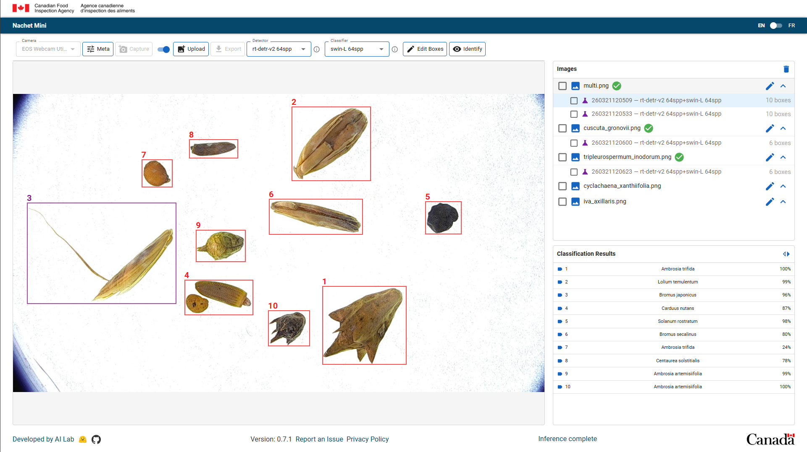
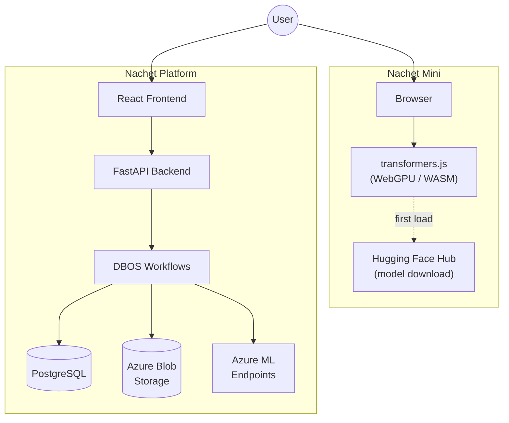
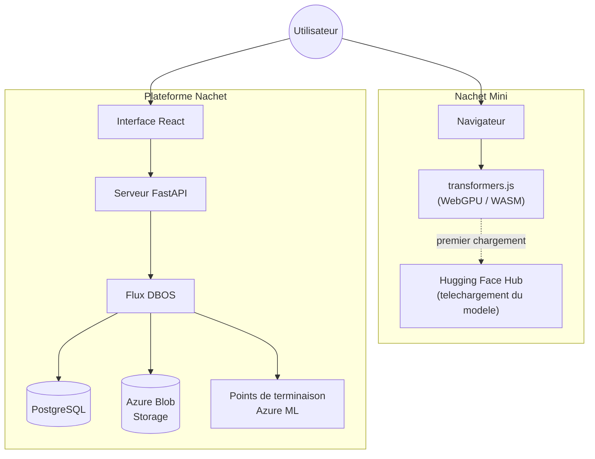

# Nachet

<!-- Repo stats -->


<!-- Activity -->


<!-- Code quality -->


*[Le francais suit](#nachet-fr)*

Nachet is an open-source, AI-powered image classification system developed by
the [Canadian Food Inspection Agency (CFIA)](https://inspection.canada.ca). It
helps inspectors and researchers identify regulated weed seeds using machine
learning — but its architecture is domain-agnostic and can be applied to any
image classification task. The project ships as two products: **Nachet Mini**, a
lightweight client-side web app, and the **Nachet Platform**, a full
server-backed system for laboratory use.

---

## Nachet Mini

**Client-side, privacy-focused image classification — right in your browser.**



**[DEMO on Cloudflare](https://www.nachetproject.com)**
**[DEMO on Github Pages](https://ai-cfia.github.io/nachet/)**

Nachet Mini runs entirely in your browser. Your images never leave your device;
there is no server, no account, and no cloud infrastructure involved. It uses
[transformers.js](https://huggingface.co/docs/transformers.js) to perform ML
inference directly on your machine via WebGPU or WASM.

- **Privacy by design** — images are processed locally; nothing is uploaded
- **No account required** — open the page and start classifying
- **Offline-capable** — works without a network connection after the initial
  model download
- **Domain-agnostic** — currently trained for weed seed identification, but the
  platform supports any image classification model
- **Fast** — leverages WebGPU acceleration when available, with automatic WASM
  fallback

Read the [privacy statement](nachet-mini/privacy.md) |
[Models on Hugging Face](https://huggingface.co/cfia-ai-lab)

---

## Nachet Platform

**A full-featured, server-backed system for laboratory and field use.**


The Nachet Platform is designed for professional workflows where centralized
infrastructure, audit trails, and high-throughput batch processing are needed.

- **Microscope and webcam integration** — capture images directly from connected
  devices
- **Batch upload and processing** — analyze many images in a single session
- **Durable async workflows** — ML inference is orchestrated with
  [DBOS](https://docs.dbos.dev/) for crash-recoverable, resumable pipelines
- **Azure AD authentication** — secure, role-based access for teams
- **Bilingual interface** — full English and French support
- **Audit-ready** — results, metadata, and images stored in PostgreSQL and Azure
  Blob Storage

---

## Key Features

- AI-powered object detection and classification
- Client-side inference with privacy by design (Nachet Mini)
- Microscope and webcam image capture
- Batch upload and processing
- Asynchronous ML inference with durable, recoverable workflows
- Bilingual interface (English / French)
- Open source under the MIT license

---

## Architecture



**Nachet Mini** is a standalone static site — no server required. Models are
downloaded from Hugging Face on first use and cached in the browser.

**Nachet Platform** follows a traditional client-server architecture. The React
frontend communicates with a FastAPI backend that orchestrates ML inference
through durable DBOS workflows, with PostgreSQL for metadata and Azure Blob
Storage for images.

---

## Tech Stack

| Component | Technology |
| --- | --- |
| Nachet Mini | React + TypeScript + Vite + MUI + transformers.js |
| Frontend | React + TypeScript + Vite + MUI + Zustand |
| Backend | Python + FastAPI + SQLAlchemy + DBOS |
| Database | PostgreSQL |
| Storage | Azure Blob Storage (or S3-compatible) |
| ML Inference | Azure ML Endpoints (server) / Hugging Face (client) |
| Auth | Azure AD (OAuth 2.0) |
| i18n | English / French |

---

## Getting Started

### Try Nachet Mini

Visit **[DEMO on Github Pages](https://ai-cfia.github.io/nachet/)** — no installation
needed.

### Run the Full Platform Locally

See **[DEVELOPER.md](DEVELOPER.md)** for complete setup instructions, including
Docker Compose, environment configuration, and database setup.

Quick start:

```bash
# Clone the repository
git clone https://github.com/ai-cfia/nachet.git
cd nachet

# Start all services with Docker Compose
docker-compose up --build
```

---

## For Developers

Contributions are welcome. Start with the developer guide and the component
READMEs:

- **[DEVELOPER.md](DEVELOPER.md)** — Full local setup, environment variables,
  Docker configuration
- **[frontend/README.md](frontend/README.md)** — Frontend development, scripts,
  testing
- **[backend/README.md](backend/README.md)** — Backend development, API, testing
- **[docs/ADR-2026-02-nachet-mini.md](docs/ADR-2026-02-nachet-mini.md)** —
  Architecture decision record for Nachet Mini

---

## License

This project is licensed under the [MIT License](LICENSE).

Copyright (c) 2024 AI @ Canadian Food Inspection Agency (CFIA)

## Contact

[cfia.ai-ia.acia@inspection.gc.ca](mailto:cfia.ai-ia.acia@inspection.gc.ca)

---

## Nachet (FR)

<!-- Statistiques du depot -->


<!-- Activite -->


<!-- Qualite du code -->


Nachet est un systeme de classification d'images par intelligence artificielle,
a code source ouvert, developpe par l'[Agence canadienne d'inspection des
aliments (ACIA)](https://inspection.canada.ca). Il aide les inspecteurs et les
chercheurs a identifier les semences de mauvaises herbes reglementees grace a
l'apprentissage automatique. Son architecture est toutefois independante du
domaine et peut s'appliquer a toute tache de classification d'images. Le projet
se decline en deux produits : **Nachet Mini**, une application web legere
fonctionnant cote client, et la **Plateforme Nachet**, un systeme complet avec
serveur pour une utilisation en laboratoire.

---

## Nachet Mini _

**Classification d'images cote client, axee sur la confidentialite — directement
dans votre navigateur.**


**[DEMO sur Cloudflare](https://www.nachetproject.com)**
**[DEMO sur les pages Github](https://ai-cfia.github.io/nachet/)**

Nachet Mini fonctionne entierement dans votre navigateur. Vos images ne quittent
jamais votre appareil — il n'y a ni serveur, ni compte, ni infrastructure
infonuagique. L'application utilise
[transformers.js](https://huggingface.co/docs/transformers.js) pour effectuer
l'inference ML directement sur votre machine via WebGPU ou WASM.

- **Confidentialite des la conception** — les images sont traitees localement;
  rien n'est televerse
- **Aucun compte requis** — ouvrez la page et commencez a classifier
- **Fonctionne hors ligne** — utilisable sans connexion reseau apres le
  telechargement initial du modele
- **Independant du domaine** — actuellement entraine pour l'identification des
  semences de mauvaises herbes, mais la plateforme prend en charge tout modele
  de classification d'images
- **Rapide** — tire parti de l'acceleration WebGPU lorsque disponible, avec
  basculement automatique vers WASM

Lire la [declaration de confidentialite](nachet-mini/privacy.md) |
[Modeles sur Hugging Face](https://huggingface.co/cfia-ai-lab)

---

## Plateforme Nachet

**Un systeme complet avec serveur pour une utilisation en laboratoire et sur le
terrain.**


La Plateforme Nachet est concue pour les flux de travail professionnels
necessitant une infrastructure centralisee, des pistes d'audit et un traitement
par lots a haut debit.

- **Integration de microscope et webcam** — capturez des images directement a
  partir d'appareils connectes
- **Televersement et traitement par lots** — analysez de nombreuses images en
  une seule session
- **Flux de travail asynchrones durables** — l'inference ML est orchestree avec
  [DBOS](https://docs.dbos.dev/) pour des pipelines recuperables et resumables
- **Authentification Azure AD** — acces securise base sur les roles pour les
  equipes
- **Interface bilingue** — prise en charge complete de l'anglais et du francais
- **Pret pour l'audit** — resultats, metadonnees et images stockes dans
  PostgreSQL et Azure Blob Storage

---

## Fonctionnalites cles

- Detection et classification d'objets par intelligence artificielle
- Inference cote client avec confidentialite des la conception (Nachet Mini)
- Capture d'images par microscope et webcam
- Televersement et traitement par lots
- Inference ML asynchrone avec flux de travail durables et recuperables
- Interface bilingue (anglais / francais)
- Code source ouvert sous licence MIT

---

## Architecture _



**Nachet Mini** est un site statique autonome — aucun serveur requis. Les
modeles sont telecharges depuis Hugging Face lors de la premiere utilisation et
mis en cache dans le navigateur.

**La Plateforme Nachet** suit une architecture client-serveur traditionnelle.
L'interface React communique avec un serveur FastAPI qui orchestre l'inference ML
a travers des flux de travail DBOS durables, avec PostgreSQL pour les
metadonnees et Azure Blob Storage pour les images.

---

## Pile technologique

| Composant | Technologie |
| --- | --- |
| Nachet Mini | React + TypeScript + Vite + MUI + transformers.js |
| Interface | React + TypeScript + Vite + MUI + Zustand |
| Serveur | Python + FastAPI + SQLAlchemy + DBOS |
| Base de donnees | PostgreSQL |
| Stockage | Azure Blob Storage (ou compatible S3) |
| Inference ML | Points de terminaison Azure ML (serveur) / Hugging Face (client) |
| Authentification | Azure AD (OAuth 2.0) |
| i18n | Anglais / Francais |

---

## Pour commencer

### Essayer Nachet Mini

Visitez **[DEMO sur les pages Github](https://ai-cfia.github.io/nachet/)** — aucune
installation requise.

### Executer la plateforme complete localement

Consultez **[DEVELOPER.md](DEVELOPER.md)** pour les instructions completes de
configuration, y compris Docker Compose, la configuration de l'environnement et
la mise en place de la base de donnees.

Demarrage rapide :

```bash
# Cloner le depot
git clone https://github.com/ai-cfia/nachet.git
cd nachet

# Demarrer tous les services avec Docker Compose
docker-compose up --build
```

---

## Pour les developpeurs

Les contributions sont les bienvenues. Commencez par le guide du developpeur et
les README des composants :

- **[DEVELOPER.md](DEVELOPER.md)** — Configuration locale complete, variables
  d'environnement, configuration Docker
- **[frontend/README.md](frontend/README.md)** — Developpement de l'interface,
  scripts, tests
- **[backend/README.md](backend/README.md)** — Developpement du serveur, API,
  tests
- **[docs/ADR-2026-02-nachet-mini.md](docs/ADR-2026-02-nachet-mini.md)** —
  Dossier de decision architecturale pour Nachet Mini

---

## Licence

Ce projet est distribue sous la [licence MIT](LICENSE).

Copyright (c) 2024 AI @ Agence canadienne d'inspection des aliments (ACIA)

## Contact _

[cfia.ai-ia.acia@inspection.gc.ca](mailto:cfia.ai-ia.acia@inspection.gc.ca)
