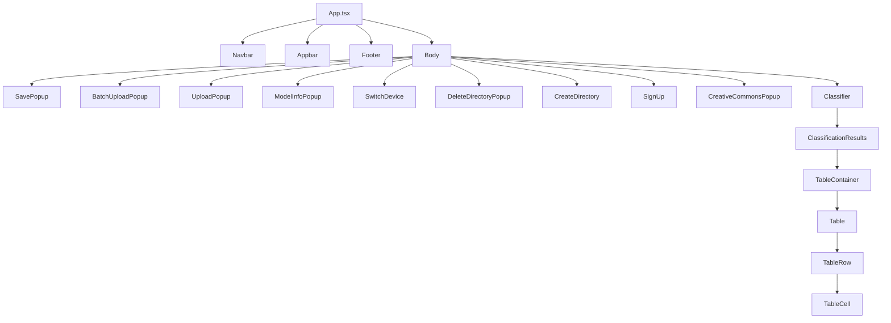

# Frontend Architecture Documentation

## Overview

The Nachet frontend is a **Single Page Application (SPA)** built with React 18 and TypeScript, designed for AI-powered seed identification workflows. The application follows a **component-based architecture** with clear separation of concerns, utilizing modern React patterns and hooks for state management.

## Technology Stack

### Core Technologies

- **React 18.2** - Component library with React.StrictMode
- **TypeScript 5.8** - Type safety and developer experience
- **Vite 5.2** - Build tool and development server
- **React Router DOM 6.14** - Client-side routing with HashRouter

### UI Framework & Styling

- **Material-UI 5.14** - Component library (`@mui/material`, `@emotion/react`)
- **Styled Components 6.0** - CSS-in-JS styling
- **React Icons 4.10** - Icon library

### Specialized Libraries

- **Axios 1.6** - HTTP client for API communication
- **React Webcam 7.1** - Camera access for image capture
- **Browser Image Compression 2.0** - Client-side image optimization
- **React Picture Annotation 1.2** - Image annotation capabilities
- **UTIF 3.1** - TIFF image decoding
- **JSZip 3.10** - File compression/extraction
- **Pako 2.1** - Gzip compression
- **JWT Decode 4.0** - JWT token handling
- **JS Cookie 3.0** - Cookie management

### Development Tools

- **ESLint 8.57** - Code linting with TypeScript support
- **Prettier 3.5** - Code formatting
- **Vitest 1.4** - Unit testing framework
- **React Testing Library 14.2** - Component testing utilities

## Component Hierarchy Visualization



This graph shows the main component hierarchy and relationships in the frontend application. For clarity, only key components and their nesting are shown.

## Directory Structure & Organization

```text
frontend/src/
├── App.tsx                    # Root application component
├── main.tsx                   # Application entry point
├── index.css                  # Global styles
├── _versions.ts               # Auto-generated version info
├── vite-env.d.ts             # Vite type definitions
├── setupTests.ts             # Test configuration
│
├── assets/                   # Static assets (images, logos)
├── environments/             # Environment configuration
├── static_data/              # Static JSON data
├── styles/                   # Shared styling utilities
│
├── common/                   # Shared utilities and types
│   ├── api.ts                # Centralized API layer
│   ├── types.d.ts            # TypeScript type definitions
│   ├── cacheutils.ts         # Cache management utilities
│   ├── imageutils.ts         # Image processing utilities
│   ├── error.ts              # Custom error classes
│   └── tests/                # Unit tests for utilities
│
├── hooks/                    # Custom React hooks
│   ├── useBackendUrl.tsx     # Backend URL management
│   ├── useDecoderTiff.tsx    # TIFF decoding hook
│   └── tests/                # Hook tests
│
├── components/               # Reusable UI components
│   ├── header/               # Navigation components
│   │   ├── navbar/           # Main navigation
│   │   └── appbar/           # Secondary navigation
│   ├── footer/               # Footer component
│   └── body/                 # Feature-specific components
│       ├── authentication/   # Auth forms
│       ├── batch_upload_popup/
│       ├── classification_results/
│       ├── directory_list/
│       ├── feedback_form/
│       ├── image_cache/
│       ├── loading_indicator/
│       ├── microscope_feed/
│       ├── model_popup/
│       └── [other features]/
│
├── pages/                    # Page-level components
│   └── classifier/           # Main classifier page
│
└── root/                     # Root layout components
    └── body/                 # Main body container
```

## Architectural Patterns

### 1. Component Architecture

#### **Feature-Based Organization**

Components are organized by feature/domain rather than technical concerns:

- `authentication/` - User authentication flows
- `classification_results/` - ML inference results display
- `directory_list/` - File/directory management
- `feedback_form/` - User feedback collection

#### **Index Pattern**

Each component directory follows the index pattern:

```typescript
// Component implementation
ComponentName.tsx

// Styled components and utilities  
ComponentNameElements.tsx  

// Public interface
index.ts
```

#### **Compound Components**

Complex features use compound component patterns:

```typescript
// Main container
StorageDirectoryContainer.tsx
// Presentation layer  
StorageDirectoryView.tsx
// Public interface
index.tsx
```

### 2. State Management Strategy

#### **No Global State Library**

The application deliberately avoids Redux/Zustand, using React's built-in state management:

```typescript
// App-level state
const [uuid, setUuid] = useState<string>("");
const [signedIn, setSignedIn] = useState<boolean>(true);
const [windowSize, setWindowSize] = useState({width: window.innerWidth, height: window.innerHeight});

// State drilling pattern
<Body
  uuid={uuid}
  signedIn={signedIn}
  setSignedIn={setSignedIn}
  setUuid={setUuid}
/>
```

#### **Custom Hooks for Business Logic**

Business logic is extracted into custom hooks:

```typescript
// useBackendUrl.tsx - Environment management
const useBackendUrl = (): string => {
  const backendURL = useMemo(() => {
    return process.env.VITE_BACKEND_URL ?? "";
  }, []);
  return backendURL;
};

// useDecoderTiff.tsx - TIFF processing
const useDecoderTiff = (): DecodedTiff => {
  // Complex TIFF decoding logic
};
```

### 3. API Architecture

#### **Centralized API Layer**

All backend communication flows through `common/api.ts`:

```typescript
// Generic HTTP handler with error management
const handleAxios = async <T>(request: {
  method: string;
  url: string; 
  headers: { [label: string]: string };
  data: any;
}): Promise<T> => {
  // Axios wrapper with comprehensive error handling
};

// Feature-specific API functions
export const readAzureStorageDir = async (backendUrl: string, uuid: string): Promise<ReadAzureStorageDirApi>
export const inferenceRequest = async (backendUrl: string, imageData: string, uuid: string): Promise<ApiInferenceData>
```

#### **Type-Safe API Contracts**

All API interactions use TypeScript interfaces defined in `common/types.d.ts`:

```typescript
export interface ApiInferenceData {
  filename: string;
  imageId: string;
  inference_id: string;
  boxes: Array<{
    topN: Array<{ score: number; label: string }>;
    score: number;
    label: string;
    // ... detailed type definitions
  }>;
}
```

### 4. Data Flow Patterns

#### **Cache-First Architecture**

The application implements sophisticated caching via `cacheutils.ts`:

```typescript
// Cache management functions
loadCaptureToCache()     // Image caching
loadResultsToCache()     // Inference result caching  
nextCacheIndex()         // Cache navigation
getLabelOccurrence()     // Label data aggregation
```

#### **Event-Driven Updates**

State updates flow through callback props and event handlers:

```typescript
// Parent defines behavior
const handleCreativeCommonsAgreement = (agree: boolean): void => {
  if (agree) {
    Cookies.set("creative-commons-agreement", "true", { expires: 365 * 10 });
  }
  setCreativeCommonsPopupOpen(false);
};

// Child receives callback
<CreativeCommonsPopup 
  handleCreativeCommonsAgreement={handleCreativeCommonsAgreement}
/>
```

### 5. Error Handling Strategy

#### **Custom Error Hierarchy**

Defined in `common/error.ts`:

```typescript
export class AzureAPIError extends Error {
  constructor(message: string) {
    super(message);
    this.name = "AzureAPIError";
  }
}

export class ValueError extends Error { /* ... */ }
export class DecodeError extends Error { /* ... */ }
export class FetchError extends Error { /* ... */ }
export class BlobError extends Error { /* ... */ }
```

#### **Comprehensive Error Boundaries**

API errors are caught and handled at multiple levels:

- Axios interceptors for HTTP errors
- Component-level error handling
- User-friendly error messages

## Configuration Management

### Environment Configuration

Multi-environment setup with type safety:

```typescript
// environments/environment.ts (development)
export const environment = {
  production: false,
  version: versions.version,
};

// environments/environment.prod.ts (production)  
export const environment = {
  production: true,
  version: versions.version,
};
```

### Build Configuration

Vite configuration with environment variable support:

```typescript
// vite.config.ts
export default defineConfig({
  plugins: [
    react(),
    EnvironmentPlugin("all"), // include all environment variables
  ],
  define: {
    "process.env": {},
  },
});
```

## Testing Architecture

### Testing Stack

- **Vitest** - Fast unit test runner (Vite-native)
- **React Testing Library** - Component testing utilities
- **Jest DOM** - Custom Jest matchers for DOM testing
- **User Event** - User interaction simulation

### Testing Patterns

```typescript
// Component testing example
import { render, screen } from '@testing-library/react';
import userEvent from '@testing-library/user-event';

// Hook testing example  
import { renderHook } from '@testing-library/react';
import useBackendUrl from '../useBackendUrl';
```

### Test Organization

- Tests co-located with source code in `tests/` subdirectories
- Comprehensive API layer testing in `common/tests/`
- Custom hook testing in `hooks/tests/`

## Performance Optimizations

### Image Processing

- **Client-side compression** via `browser-image-compression`
- **TIFF decoding** with `utif` library
- **Canvas-based rendering** for annotations and overlays

### Caching Strategy

- **Result caching** for ML inference results
- **Image caching** for processed images  
- **Cookie-based persistence** for user preferences

### Bundle Optimization

- **Vite** for fast development builds
- **SWC** for React compilation (via `@vitejs/plugin-react-swc`)
- **Tree shaking** and code splitting

## Key Architectural Decisions

### 1. **Hash Routing vs Browser Routing**

**Choice**: HashRouter
**Rationale**: Simpler deployment, works without server configuration

### 2. **No Global State Management**

**Choice**: React state + prop drilling
**Rationale**: Application complexity doesn't justify Redux/Zustand overhead

### 3. **Feature-Based Component Organization**

**Choice**: Group by feature/domain
**Rationale**: Better scalability and maintainability than technical grouping

### 4. **Custom API Layer vs External Client**

**Choice**: Custom Axios wrapper
**Rationale**: Fine-grained error handling and caching control

### 5. **TypeScript Everywhere**

**Choice**: Strict TypeScript with comprehensive type definitions
**Rationale**: Better developer experience and runtime safety

## Security Considerations

### Authentication

- **JWT token handling** via `jwt-decode`
- **Cookie-based session management** with `js-cookie`
- **Secure credential storage** patterns

### Data Protection

- **Client-side image compression** before upload
- **UUID-based resource identification**
- **Error message sanitization**

## Development Workflow

### Local Development

```bash
npm run dev          # Start development server (localhost:5173)
npm run lint         # ESLint checking
npm run format       # Prettier formatting  
npm run test         # Vitest testing
npm run test:coverage # Coverage reporting
```

### Production Build

```bash
npm run build        # TypeScript compilation + Vite build
npm run preview      # Preview production build locally
```

### Code Quality

- **Pre-commit hooks** with ESLint and Prettier
- **TypeScript strict mode** for type safety
- **Test coverage** tracking with Vitest
- **Consistent formatting** with Prettier configuration

## Future Considerations

### Potential Enhancements

1. **Global State Management** - Consider Zustand if application complexity grows
2. **React Query/SWR** - For more sophisticated API caching
3. **Component Library** - Extract reusable components to separate package
4. **Micro-Frontend Architecture** - If application grows significantly
5. **Progressive Web App** - Add service worker and offline capabilities

### Technical Debt Areas

1. **Props Drilling** - Deep component hierarchies with many props
2. **Large Components** - Some components could be broken down further
3. **Error Boundaries** - Need React error boundaries for better error isolation
4. **Performance Monitoring** - Add performance tracking and monitoring

---

This architecture supports the application's core mission of providing a responsive, type-safe, and maintainable interface for AI-powered seed identification workflows.
